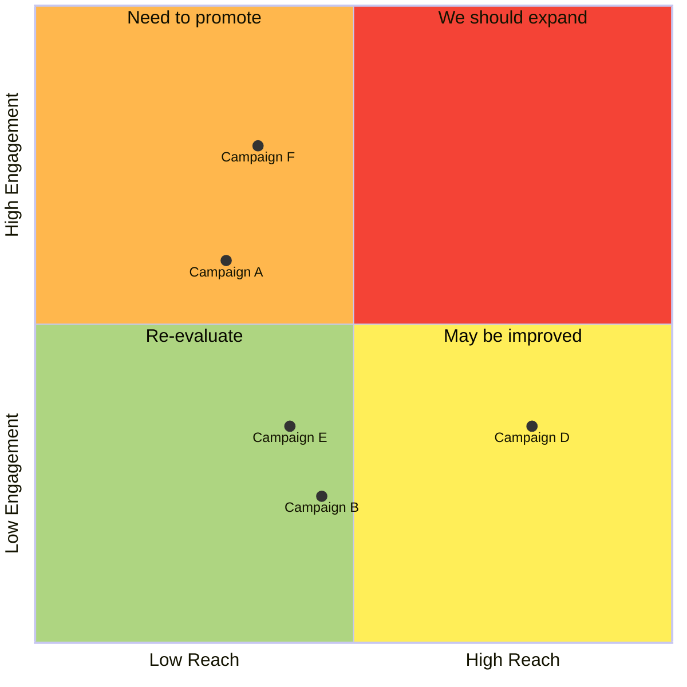

# tiot
node-red, couchdb/cloudant, lorawan, find description at https://tiot.home.blog/

1_node-red-sorting-metadata-rssi.json
https://tiot.home.blog/2021/01/07/node-red-jsonata-sort-ttn-metadata-by-rssi/

2_ node-red-couchdb-cloudant-select-data-last-n-minutes-and-sum-a-value
https://tiot.home.blog/2021/03/15/node-red-couchdb-cloudant-select-data-last-n-minutes-and-sum-a-value/

3_node-red-couchdb-cloudant-jsonata-tabulator
https://tiot.home.blog/2021/03/19/node-red-couchdb-cloudant-jsonata-tabulator/

4_node-red-couchdb-cloudant-group-sum-and-select-interval
https://tiot.home.blog/2021/04/09/node-red-couchdb-cloudant-group-sum-and-select-interval/

6 Conditional formatting with UI_Table and download to .csv file in Node-red
Use of conditional coloring and download the content i the table to a csv file
https://tiot.home.blog/2022/03/05/6-conditional-formatting-with-ui_table-and-download-to-csv-file-in-node-red/

